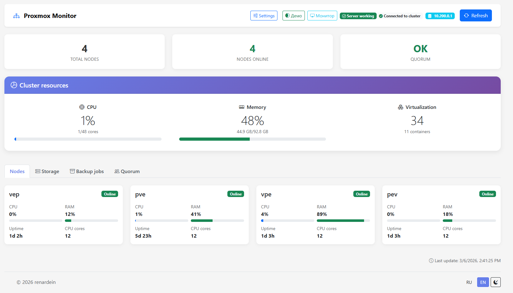

# HomeLab Monitor



## Описание проекта
**HomeLab Monitor** — это веб-приложение для мониторинга домашнего (и не только) кластера Proxmox VE в реальном времени. Приложение предоставляет удобный интерфейс для отслеживания состояния узлов, хранилищ, заданий резервного копирования и общего состояния кластера.
## Возможности
### Основные функции
- 🖥️ **Мониторинг узлов** — отображение статуса, загрузки CPU, использования RAM и времени работы каждого узла
- 💾 **Мониторинг хранилищ** — информация о всех хранилищах кластера с детализацией по использованию места
- 📦 **Задания бэкапа** — просмотр и мониторинг всех заданий резервного копирования
- 🏛️ **Кворум кластера** — отслеживание состояния кворума и голосов узлов
- 🔄 **Автоматическое обновление** — настраиваемый интервал обновления данных
- 🌐 **Мультиязычность** — поддержка русского и английского языков
- 🎨 **Темы оформления** — светлая и тёмная темы
- 🔐 **Безопасность** — авторизация через API токены Proxmox
- 💾 **Кэширование** — интеллектуальное кэширование данных с разными TTL для разных типов данных
### Интерфейс
- Адаптивный дизайн на основе Bootstrap 5
- Таблицы с сортировкой и поиском (DataTables)
- Визуальные индикаторы состояния с настраиваемыми порогами
- Уведомления (toast) о событиях
- Режим монитора для вывода на большие экраны
- Демо-режим для тестирования без подключения к кластеру
## Архитектура проекта
```
proxmox-monitor/
├── server.js                 # Главный файл сервера Express
├── package.json              # Зависимости и скрипты npm
├── .env                      # Переменные окружения
├── public/                   # Статические файлы фронтенда
│   ├── index.html           # Основной HTML-файл
│   ├── css/
│   │   └── styles.css       # Стили приложения
│   └── js/
│       └── app.js           # Клиентская логика
├── modules/                  # Модули сервера
│   ├── config.js            # Конфигурация приложения
│   ├── proxmox-api.js       # Клиент Proxmox API
│   ├── cache.js             # Система кэширования
│   ├── i18n.js              # Интернационализация
│   ├── locales.js           # Переводы (RU/EN)
│   ├── utils.js             # Утилиты
│   ├── middleware/
│   │   └── auth.js          # Middleware авторизации
│   └── routes/              # API маршруты
│       ├── status.js        # Статус сервера
│       ├── auth.js          # Маршруты авторизации
│       ├── cluster.js       # Данные кластера
│       ├── nodes.js         # Данные узлов
│       ├── storage.js       # Данные хранилищ
│       └── backups.js       # Данные бэкапов
└── node_modules/            # Зависимости npm
```
## Установка
### Требования
- Node.js версии 14 или выше
- Доступ к Proxmox VE кластеру (API)
- API токен Proxmox с необходимыми правами (Sys.Audit, Sys.Monitor, VM.Audit, VM.Monitor)
### Шаги установки
1. **Клонирование репозитория**
```bash
git clone <repository-url>
cd proxmox-monitor
```
2. **Установка зависимостей**
```bash
npm install
```
3. **Настройка переменных окружения**
Скопируйте файл `.env` и настройте параметры:
```bash
# Настройки сервера
PORT=81
NODE_ENV=production
# Настройки Proxmox
PROXMOX_HOST=10.200.0.1
PROXMOX_PORT=8006
# Настройки безопасности
CORS_ORIGIN=*
# Настройки кэша
CACHE_TTL=30
# Язык по умолчанию (ru или en)
DEFAULT_LANGUAGE=ru